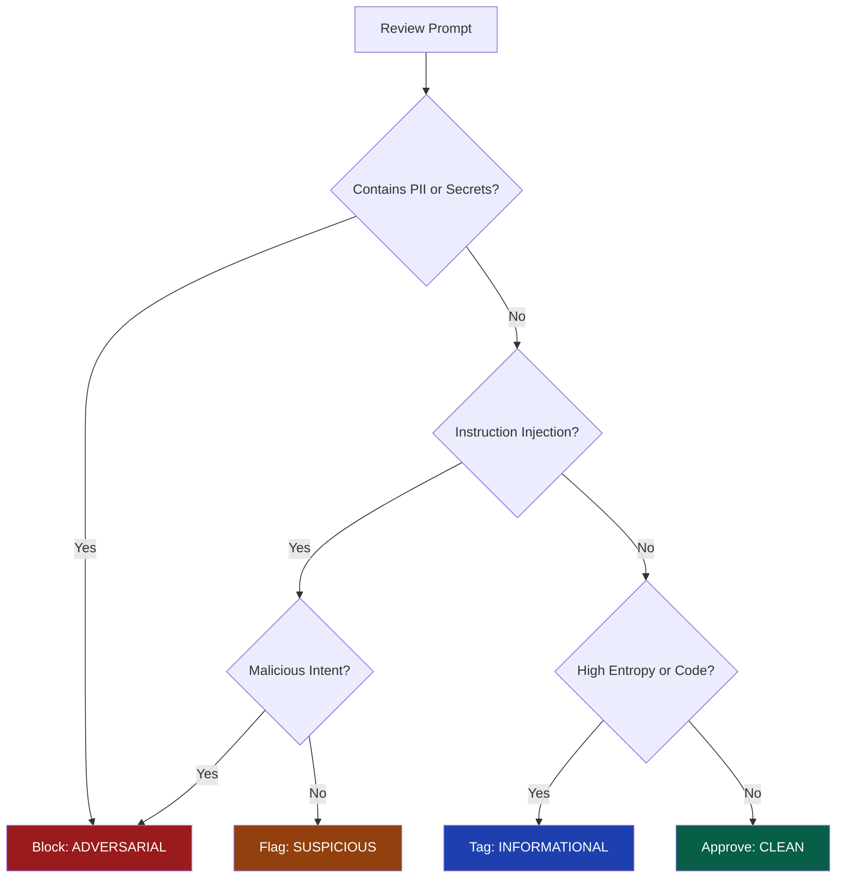

# 🛡️ Analyst & Administrator Operations Guide
## Counter-Spy.ai

| Version | Date | Description |
| :--- | :--- | :--- |
| **v2.1** | 2026-04-24 | Governance terminology refresh, entropy suspicious floor update, Bulk Ingest pause handling, selected-file visibility, and reviewed-outcome FPR/FNR metrics. |
| **v2.0** | 2026-04-21 | Promotion to Beta: stabilized local demo stack, guarded backend responder path, Lara translation modes, Sam Spade governed intake, and layered defense funnel metrics. |

---

## 1. Operational Overview

Counter-Spy.ai is an **Adversary-Aware Security Gateway**. It sits between untrusted user input and Large Language Models (LLMs) to provide a deterministic security layer. Unlike traditional firewalls, it does not simply block known bad patterns — it analyzes the **intent, complexity, and randomness** of incoming traffic to identify zero-day prompt injections and model reverse-engineering attempts.

As an Analyst or Administrator, you are the final decision-maker in the **Human-in-the-Loop (HITL)** cycle. Your primary goal is to maintain the balance between **System Resilience** (blocking attacks) and **User Experience** (minimizing false positives).

---

## 2. Daily Operations Checklist

Analysts should perform these tasks at the start of every shift:

- [ ] **Baseline Check:** Verify the 24h Threat Velocity is within ±15% of the weekly mean.
- [ ] **Queue Triage:** Clear all `PENDING_REVIEW` logs.
- [ ] **False Positive Audit:** Randomly sample 20 "Clean" logs to check for missed injections (False Negatives).
- [ ] **Knowledge Base Sync:** Ensure active guardrails match the current organization security policy.

---

## 3. Monitoring Dashboard

The **Metrics** tab is the primary interface for real-time situational awareness and your early-warning system for separating noise from targeted attacks.

### 3.1 Threat Velocity & Z-Score

The dashboard tracks the rate of threats (Suspicious or Adversarial logs) over a rolling 24-hour window.

**Threat Velocity** is expressed as a percentage change from the 24-hour baseline. A value of **+500%** indicates that current threat activity is five times higher than the recent baseline.

**Z-Score** measures how many standard deviations the current threat rate is from the mean, calculated in real-time:

$$Z = \frac{x - \mu}{\sigma}$$

| Symbol | Definition |
| :--- | :--- |
| $x$ | Current observed threat rate |
| $\mu$ | Mean threat rate over the previous 24 hours |
| $\sigma$ | Standard deviation of the threat rate |

**Alert Thresholds:**

| Z-Score | Status | Required Action |
| :--- | :--- | :--- |
| < 1.0 | Normal | No action required. |
| 1.0 – 3.0 | Active Interest | Monitor for repeated payloads from a single `userId`. |
| > 2.0 | Statistically Significant | Increase monitoring cadence. |
| > 5.0 | **Coordinated Incident** | Statistically impossible without automation. Evaluate Global System Pause. Notify Lead Architect. |

> [!IMPORTANT]
> **Notification Escalation:** When a Z-Score exceeds **5.0**, a high-priority incident is created. In production, this triggers an automated alert to **PagerDuty** and the **#soc-alerts** Slack channel.

> [!TIP]
> Use the **Hide Simulated** toggle to filter out bulk ingest and test data, ensuring metrics reflect real-world user intent only.

### 3.2 Entropy Analysis

The system calculates **Shannon Entropy** to detect obfuscation and encoding attacks:

$$H(X) = -\sum_{i=1}^{n} P(x_i) \log_b P(x_i)$$

| Metric | Description | High Score Indicates |
| :--- | :--- | :--- |
| **Global Entropy** | Randomness of the entire prompt | Word salad or incoherent noise injection |
| **Max Window Entropy** | Peak randomness in a 35-character sliding window | Base64, Hex, or encrypted payloads hidden within normal text |

**Configured Thresholds:**

| Guardrail | Suspicious | Adversarial | Purpose |
| :--- | :--- | :--- | :--- |
| **Entropy** | 4.5 | 5.5 | Catching Base64/Hex obfuscation |
| **Syntactic Complexity** | 50 | 90 | Catching instruction stacking |

---

## 4. Incident Review Workflow (HITL)

**Human-in-the-Loop (HITL)** mode intercepts borderline traffic for manual verification. When the system is uncertain, it holds the prompt in a `REVIEW` state. The end user sees a Security Verification spinner while an analyst decides the outcome.

### 4.1 Review Process

1. **Identify:** Locate logs with the purple `REVIEW` status in the queue.
2. **Inspect:** Use the **Full Prompt Inspection** dialog to view the raw, un-redacted text.
3. **Cross-Reference:** Check the **Session ID** to identify whether this user has had multiple previous interceptions.
4. **Verdict:** Assign a **Resultant Severity** using the Decision Tree below.

### 4.2 Decision Tree

### 4.3 Verdict Policy

| Verdict | User Impact | Backend Impact | Typical Use Case |
| :--- | :--- | :--- | :--- |
| **Clean** | Released to AI | Logged as OK | Confirmed false positives |
| **Informational** | Released to AI | Logged as Flagged | Code samples or unusual but harmless content |
| **Suspicious** | Blocked | User Flagged | Policy probing or light roleplay attempts |
| **Adversarial** | Blocked | User/IP Blocked | Clear injection, PII exfiltration, or DoS attempts |

---

## 5. Crisis Protocols (HOTL)

**Global System Pause** is the platform kill switch and should be treated as a DEFCON 1 event.

> [!CAUTION]
> Activating the **Global System Pause** triggers a crimson site-wide alert and halts **100% of automated inference**. Use only during verified mass-exploitation events.

### 5.1 Activation Criteria

Activate the Global System Pause when **any** of the following conditions are met:

1. **Z-Score > 5.0** sustained for more than 10 minutes.
2. **Canary Token Trigger:** The system detects `COUNTERSPY_CANARY_TOKEN` in a log, indicating a System Instruction breach.
3. **Third-Party Outage:** AWS Bedrock or Gemini is experiencing a degraded state (503 errors).

### 5.2 Recovery Protocol

> [!WARNING]
> Unpausing is more operationally dangerous than pausing. Do not skip steps.

1. **Purge:** Clear the `PENDING_REVIEW` queue of all malicious payloads accumulated during the pause.
2. **Verify:** Confirm that the attack vector (e.g., a specific regex bypass) has been patched in the **Knowledge Base**.
3. **Tune:** Adjust Entropy or Complexity thresholds to catch the pattern that triggered the pause.
4. **Resume:** Toggle the Global System Pause to **OFF**.
5. **Monitor:** Remain on the Metrics tab and observe the Z-Score for a minimum of 15 minutes to confirm new thresholds are holding.

---

## 6. DPO Workflow: The Golden Set

The **Golden Set** is the ground truth dataset for future model fine-tuning via Direct Preference Optimization (DPO). Use the **Promote to KB** feature in the Audit Log to nominate a log entry.

### 6.1 Quality Bar for Promotion

Only promote logs that meet at least one of the following criteria:

| Criterion | Description |
| :--- | :--- |
| **Failed Safety** | An injection that passed the shield but failed in production inference |
| **Obfuscation** | Clever encoding techniques such as Token Dilution, LeetSpeak, or Base64 embedding |
| **Novel Vector** | An attack pattern not represented in the current Knowledge Base |

**Required Metadata:** Every promoted log must include a clear **Rejected Reason** for the training pipeline. Entries without a reason will be excluded from the DPO batch.

---

## 7. Detection Flag Glossary

| Flag | Severity | Technical Detail |
| :--- | :--- | :--- |
| `REDOS_ATTEMPT` | **Critical** | Input caused a sanitizer timeout (>1,000ms). Indicates catastrophic regex backtracking - potential DoS attempt. |
| `TOKEN_DILUTION` | **High** | High local entropy spike in sliding window. Obfuscated payload buried in noise text. |
| `SYNTACTIC_PROBE` | **Medium** | Elevated density of imperative verbs (e.g., "forget," "ignore," "must"). Indicates system override attempt. |
| `PII_LEAK` | **Variable** | Detection of SSN, email addresses, or AWS keys. Verify whether redaction succeeded before releasing. |
| `CANARY_EXFIL` | **Critical** | Prompt or response contained the unique `COUNTERSPY_CANARY_TOKEN`. Indicates System Instruction breach — activate HOTL immediately. |
