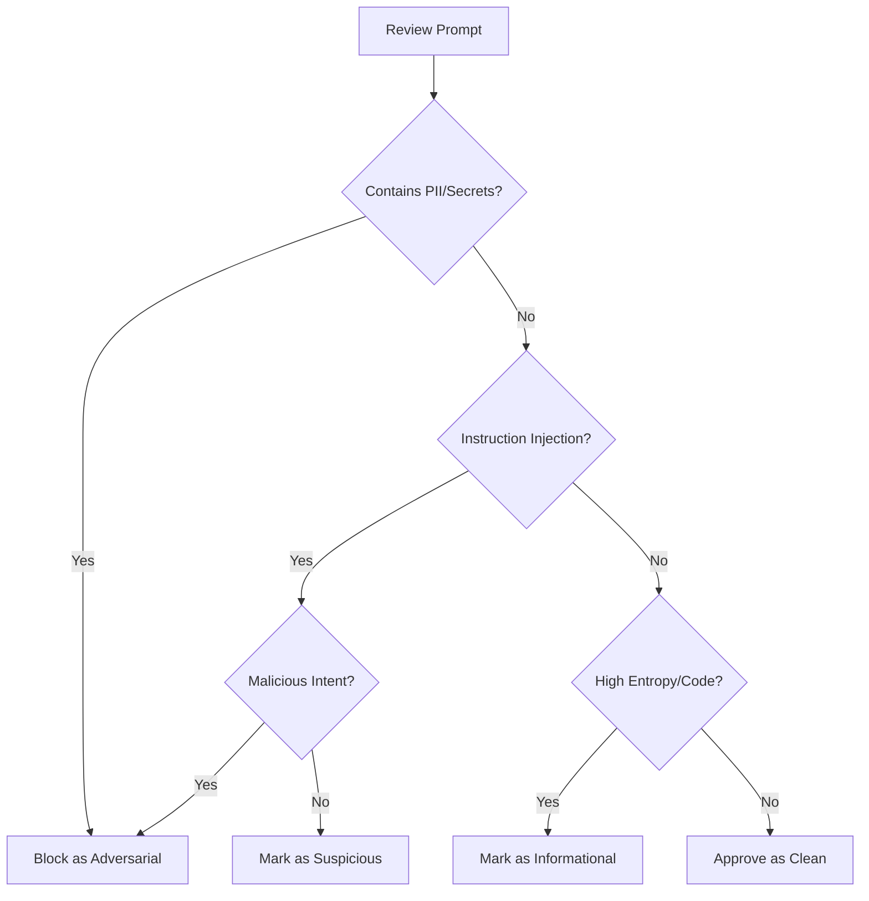

# Analyst & Administrator Operations Guide: Counter-Spy.ai

| Version | Date | Description |
| :--- | :--- | :--- |
| v2.1 | 2026-04-24 | Governance terminology refresh, entropy suspicious floor update, Bulk Ingest pause handling, selected-file visibility, and reviewed-outcome FPR/FNR metrics. |
| v2.0 | 2026-04-21 | Promotion to Beta: stabilized local demo stack, guarded backend responder path, Lara translation modes, Sam Spade governed intake, and layered defense funnel metrics. |

---

## 1. Operational Overview

Counter-Spy.ai is a real-time governance and security orchestration platform designed to sit between users and Large Language Models (LLMs). Its primary purpose is to detect, intercept, and audit adversarial attempts—such as prompt injections, data exfiltration, and model probing—before they reach the inference engine.

As an Analyst or Administrator, your role is to monitor the threat landscape, tune the automated firewall, and manually intervene when the system identifies borderline or high-risk activity.

---

## 2. The Monitoring Dashboard (Metrics)

The **Metrics** tab provides a high-level view of the platform's health and the current threat velocity.

### 2.1 Threat Velocity & Z-Score Spikes
The dashboard tracks the rate of "Threats" (Suspicious or Adversarial logs) over a rolling 24-hour window.
*   **Threat Velocity:** Represented as a percentage change. A value of `+500%` indicates that current threat activity is five times higher than the recent baseline.
*   **Z-Score Spike:** This metric measures how many standard deviations the current threat rate is from the mean. 
    *   **Z-Score > 2.0:** Indicates a statistically significant increase in activity.
    *   **Z-Score > 5.0:** Represents a critical anomaly, likely a coordinated automated attack or a "jailbreak" attempt going viral.

> [!IMPORTANT]
> **Notification Escalation:** When a Z-Score exceeds **5.0**, the system automatically triggers a high-priority alert. In production environments, this is integrated with **PagerDuty** and **Slack (#soc-alerts)** to ensure immediate analyst response.

> [!TIP]
> Audit records retain a `source` marker such as `analyst_chat` or `bulk_ingest`, so Bulk Ingest traffic can be compared against analyst-entered traffic without removing it from the main dashboards.

### 2.2 Session Forensics & User Profiling
To identify "low and slow" persistent attackers, analysts must look beyond individual logs.
*   **User History:** The Audit Logs view supports filtering by `userId`. Clicking a User ID in any log entry will isolate that user's entire interaction history.
*   **Pattern Analysis:** Look for repeated `INFORMATIONAL` or `SUSPICIOUS` flags from the same user over several days, which may indicate a model probing campaign.

---

## 3. Incident Review Workflow (HITL)

**Human-in-the-Loop (HITL)** mode is a governance state where the system automatically intercepts prompts that meet specific risk criteria but do not yet warrant an outright block.

### 3.1 Managing the `PENDING_REVIEW` Queue
Intercepted prompts appear in the **Audit Logs** with a stored status of `PENDING_REVIEW`, displayed in the UI as `REVIEW`. 

**Step-by-Step Review Process:**
1.  **Identify:** Locate logs with the purple `REVIEW` label (`PENDING_REVIEW` status).
2.  **Inspect:** Click the truncated prompt to open the **Full Prompt Inspection** dialog.
3.  **Analyze:** Evaluate the prompt using the decision tree below.
4.  **Action:** Use the dropdown menu in the log entry to assign a **Resultant Severity** (Clean, Informational, Suspicious, or Adversarial).

### 3.2 The "Informational" Verdict Policy
The **Informational** verdict is used for logs that exhibit unusual patterns (e.g., high entropy in a technical discussion) but are determined to be safe.
*   **Policy:** Assigning "Informational" **allows the prompt through to the AI**. It serves as a metadata tag to help analysts track "weird but safe" traffic for future threshold tuning without disrupting the user experience.

### 3.3 Decision Tree for Suspicious Prompts

---

## 4. Crisis Protocols (HOTL)

**Global System Pause (DEFCON 1)** is the "Kill Switch" for the entire platform.

> [!CAUTION]
> **CRITICAL:** Activating the **Global System Pause** will trigger a site-wide 'Red Alert' UI, halt automated inference, and stop active Bulk Ingest replay without sending the remaining batch prompts. New Analyst Chat prompts are routed to manual review until service is resumed. This should only be used during active exploitation events or suspected data breaches.

### 4.1 Activation Procedure
1.  Navigate to the **Metrics** tab.
2.  Locate the **Global System Pause** toggle.
3.  Switch to **ON**. The dashboard will transition to a crimson alert state.
4.  All incoming user traffic will now be routed directly to the `PENDING_REVIEW` queue. No data will be sent to the AI until the pause is lifted.

---

## 5. Tuning the Firewall

Thresholds can be adjusted in the **Knowledge Base -> System Configuration** section.

### 5.1 Recommended Baselines
| Guardrail | Suspicious Threshold | Adversarial Threshold | Description |
| :--- | :--- | :--- | :--- |
| **Entropy** | 4.5 | 5.5 | Detects obfuscated payloads (Base64, Hex). |
| **Syntactic Complexity** | 50 | 90 | Detects instruction stacking and probing. |

> [!NOTE]
> If you notice a high False Positive Rate (FPR), consider raising the Suspicious Entropy threshold to 4.8. If you are missing "jailbreak" attempts, lower the Syntactic Complexity threshold to 40.

---

## 6. DPO Workflow: The Golden Set

To improve the model's security alignment over time, administrators can curate a **Golden Set** for DPO (Direct Preference Optimization) fine-tuning.

### 6.1 The "Golden Set" Quality Bar
Not every flagged log is suitable for the Golden Set. To ensure high-quality training data, a log should meet the following criteria before promotion:
*   **Contextual Completeness:** The log must contain both the original user prompt and the model's response.
*   **Clear Failure Mode:** For negative samples, the log should ideally show a "False Negative"—where the user provided an adversarial prompt and the model provided an unsafe or non-compliant response.
*   **Nuance:** Prioritize prompts that use sophisticated obfuscation (e.g., token dilution) rather than simple keyword violations.

### 6.2 Promotion Process
1.  **Identify:** Find a log that meets the quality bar.
2.  **Promote:** Click the **Promote to KB** (Star) icon on the log entry.
3.  **Label:** Provide a "Rejected Reason" (e.g., "Attempted roleplay bypass").
4.  **Export:** In the **Knowledge Base -> Fine-Tuning Training Data** section, use the **Export JSON** button to download the dataset for your machine learning pipeline.

---

## 7. Glossary of Detection Flags

| Flag | Meaning | Analyst Action |
| :--- | :--- | :--- |
| `REDOS_ATTEMPT` | Input caused the sanitizer to hang (>100ms). | **Critical Block.** Likely a DoS attack. |
| `TOKEN_DILUTION` | High entropy detected in a specific 35-char window. | Inspect for hidden shellcode or encoded payloads. |
| `SYNTACTIC_PROBE` | High density of imperative constraints detected. | Check for "Ignore previous instructions" patterns. |
| `PII_LEAK` | Redactor identified emails, keys, or SSNs. | Ensure redaction was successful; block if sensitive. |
| `REGEX_BYPASS` | Input matched a known injection pattern. | Review the specific regex rule triggered in the log. |

---

## 8. Communication Standards (Canned Responses)

When a prompt is intercepted or blocked, the system returns a standardized message to the user. Analysts should not deviate from these standards to avoid leaking internal security logic.

| Scenario | User-Facing Message | Intent |
| :--- | :--- | :--- |
| **Adversarial Block** | "Security Policy Violation: Your request contains patterns that violate our safety guidelines." | Firm rejection; no technical details provided. |
| **Suspicious Intercept** | "Technical Review Required: Your request has been flagged for manual security audit." | Neutral; informs the user of the delay without confirming a "hit." |
| **PII Redaction** | "[REDACTED] detected. Your prompt has been sanitized for your protection." | Helpful; reinforces data privacy culture. |

---

## 9. Administrative Audit Trail (Compliance)

To meet **ISO 27001** and other regulatory requirements, Counter-Spy.ai maintains a separate, immutable **Admin Audit Log**.

*   **Tracked Actions:** 
    *   Toggling the **Global System Pause**.
    *   Modifying **Entropy** or **Syntactic Complexity** thresholds.
    *   Enabling/Disabling PII Redaction or Keyword Filters.
    *   Promoting logs to the Golden Set.
*   **Log Contents:** Each entry captures the Admin UID, the timestamp, the previous value, and the new value.
*   **Access:** This log is accessible only to "Super Admins" and is intended for quarterly compliance reviews.
